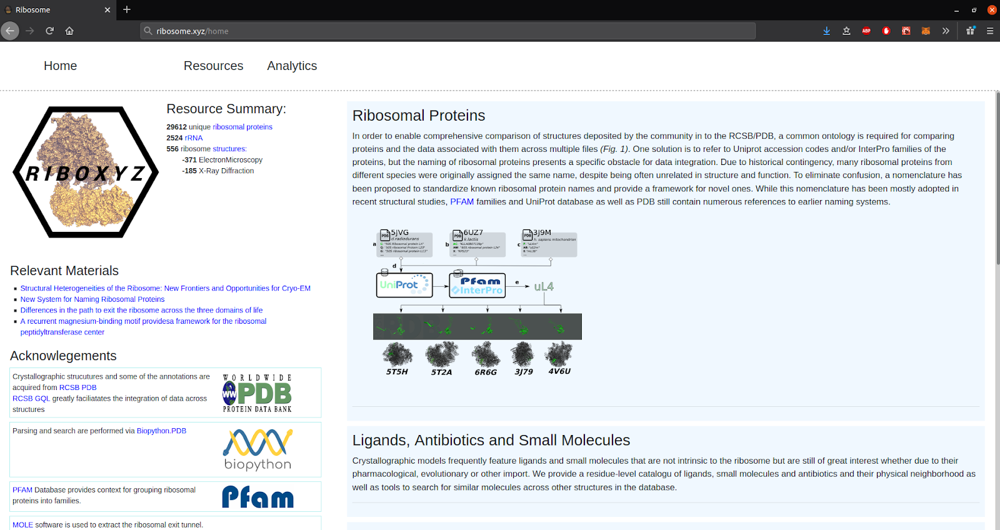

# Homepage
[ /home ](https://ribosome.xyz/home)

**Ribosomal Proteins**

In order to enable comprehensive comparison of structures deposited by the community in to the RCSB/PDB, a common ontology is required for comparing proteins and the data associated with them across multiple files (Fig. 1). One solution is to refer to Uniprot accession codes and/or InterPro families of the proteins, but the naming of ribosomal proteins presents a specific obstacle for data integration. Due to historical contingency, many ribosomal proteins from different species were originally assigned the same name, despite being often unrelated in structure and function. To eliminate confusion, a nomenclature has been proposed to standardize known ribosomal protein names and provide a framework for novel ones. While this nomenclature has been mostly adopted in recent structural studies, PFAM families and UniProt database as well as PDB still contain numerous references to earlier naming systems.

**Ligands, Antibiotics and Small Molecules**

Crystallographic models frequently feature ligands and small molecules that are not intrinsic to the ribosome but are still of great interest whether due to their pharmacological, evolutionary or other import. We provide a residue-level catalogu of ligands, small molecules and antibiotics and their physical neighborhood as well as tools to search for similar molecules across other structures in the database.

**Ribosome Exit Tunnel**

Ribosome exit tunnel and the peptidyl-transferase center are of particular interest in the exploration of the translation process and evolutionary modifications in different species. We gather a selection of exit-tunnel models from the available structures in the hopes of further extending this dataset in the future.

The constitution of the exit tunnel is of interest for evolutionary, physio-chemical and pharmacological reasons. We provide a mechanism to export some preliminary data about the walls of the exit tunnel as well cylinder-centerline of the tunnel as is caputured in a given model.

Three main features are provided at the moment that characterize the tunnel walls:

1. Residue profile of the RPs that interface with the tunnel.
(Each protein is identified by its new nomenclature (ex. uL4) where is possible and can thus be compared against
homologous chains in other structures.The in-chain IDs of the tunnel-interfacing residues are provided for each protein.)

3. Nucleotides of the RNA that interface with the tunnel.

4. Ligands, ions or small molecules if any are found embedded in the walls of the tunnel.

**Ribosomal RNA, tRNA and mRNA**

A centralized resource to search, access and compare individual rRNA strands across a variety of structures

**Current Limitations/Work in progress**

Due to the additional peculiarities of the mitochonodrial ribosome structrue, the current version of the database makes no distinction between cystosolic and mitochondiral, chloroplast ribosomes. Hence, the corresponding nomenclature classes(i.e. uL4m or uL4c) are also absent from the proteins repository.

The species classes of certain structures are somewhat ambiguous due to the fact that PDB marks individual proteins, not whole structures as belongign to a certain species and hence if some structures contain proteins from multiple species, multiple species figure in this structure 's profile(ex.)

1. Classification of structures according to following charateristics is desirable, but is not yet implemneted:
    -  Stages of translation cycle
    -  Large/Small subunits introspection 
2. Search according to a desirable set of proteins/ligands
3. Classification for ribosomal proteins based on:
    - Buried/solvent-exposed/PTC-interfacing position
    - Neighboring proteins
4. Nomenclature tool to deduce the class of a protein/proteins based on 3D structure/sequence

#  DATA SECTION

# Structures
[/structs](https://ribosome.xyz/structs)

Listed here are models of the ribosome deposited to the Protein Data Bank (include 2014).  These include different stages of the translation cycle, assembly and separate subunits.

# Ribosomal Proteins

[/rps](https://ribosome.xyz/rps)

Gathered here are ribosomal proteins that appear in all structures organized into the classes as defined in Ban. All individual chains are available for download, structural- and sequences [ alignment ](https://ribosome.xyz/rpalign).  

# Ribosomal RNA
[/rna](https://ribosome.xyz/rps)

Individual rRNA, mRNA and tRNA strands along with some RNA-like strands are listed here and made available for download and search.

# Ligands, Antibiotics, Ions and Small molecules
[/ligands](https://ribosome.xyz/ligands)

Ligands, antibiotics and small molecules that figure in the listed structures are gathered here. You can search acroos structures in which a given ligand is present or, conversely, see which ligands figure in given structure. 

Given that the binding interface of a certain ligand/antibiotic with the structures might be of interest, we export those in a separate(for now) <a href="/interfaces" >tool</a>.

We are also ignoring ions(most have not been parsed and listed) for the most part for now given their ubiquity in the resolved structures. We still acknolwedge their importance in certain cases  <a href="https://pubmed.ncbi.nlm.nih.gov/19279186/">( ex. the recurrent magnesium-binding motif near the PTC)</a> and aim to add those with more deliberation in later work.

# TOOLS/ANALYTICS SECTION

# RP Classification

[/classify](https://www.ribosome.xyz/classify)

The absence of standardized naming scheme for ribosomal proteins has been an obstacle to investigation of compositional heterogeneity. We implement the recently proposed nomenclature in code and with reference to sequence-derived protein families (PFAM, Interpro).This makes possible investigation of protein-classes across structures and species.

[ I will also include a downloadable table of mappings between PFAM families and Ban Classes here.]

# Binding Interfaces

[/interfaces](https://www.ribosome.xyz/classify)

Ribosomal models are frequently resolved containing extraneous molecules such as antibiotics, inhibitors, transport- and messenger- RNA strands, and ligands. Most of these are of potential pharmacological interest. We provide  "binding interfaces" that detail the nature of the binding site across structures for each particular ligand. For a number of ribosomal structures ligands are available(ions are filtered out): you can inspect and download a "binding interface" for each ligand.

A binding interface consists of the residue-wise profile of the ligand itself and the [non-ligand] neighbor-residues(Neighbors) that are within the radius of *5* Angstrom of the ligand.

For each residue its ID is provided along with its parent strand as per the source crystallographic file, which is enough to identify a residue uniquely. Each strand or subchain can be separately downloaded via the icon. Furthermore, the individual ligand interface can also be downloaded as a `.json` report.

# Exit Tunnel

[/tunnel](https://www.ribosome.xyz/tunnel)

The constitution of the exit tunnel is of interest for evolutionary, physio-chemical and pharmacological reasons. We provide a mechanism to export some preliminary data about the walls of the exit tunnel as well cylinder-centerline of the tunnel as caputured by the MOLE cavity-detection algorithm.

Three main features are provided at the moment that characterize tunnel walls:

- Residue-profiles of the ribosomal proteins that interface with the tunnel. (Each protein is identified by its new nomenclature (ex. uL4, where is possible) and can thus be compared against homologous chains in other structures. The in-chain IDs of the tunnel-interfacing residues are provided for each protein.
- Nucleotide IDs in the RNA chains that interface with the tunnel. 
- Ligands, ions or small molecules ( if any are found ) embedded in the walls of the tunnel.

#### Tunnel-Extraction Method:

The tunnel shape is extracted via the MOLE software. We search for residues-neighbors inside the structure that are within 10 Angstrom of each coordinate-step of the resulting tunnel-model. 

####  In development:

We plan to augment these data with conservation scores and physio-chemical profiles kindly provided by the ProteoVision database and Loren William's group at Georgia Insititute of Technology in the course of further development of both databases.

Quantitative methods have been developed for the analysis of the ribosome exit tunnel which is a region intimately involved in the construction of the nascent peptide chain. We plan to extend this to the large subset (200+) of structures in the database that have canonical composition, i.e. where the subunits are well-assembled.

# RP Alignment

[ /rpalign ](https://ribosome.xyz/rpalign)

Not sure what to say here. Will stick a molecular viewer at some point to visualize superimposed chains on the fly.